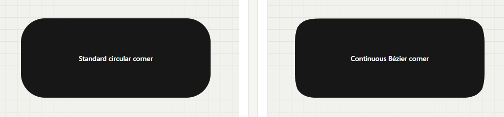

# border-bezier

A tiny, dependency-free CSS + JavaScript library for smooth, continuous
Bézier corners beyond standard `border-radius`.

[](./LICENSE)


Use the Modern package in current projects, or copy the Legacy files into any
HTML page and open it directly. Node.js, npm, TypeScript, and a server are all
optional for the Legacy mode.

<p align="center">
  
</p>

## Live demo

[Open the interactive playground](https://lihnnh.github.io/border-bezier/)

The playground stays on the repository root so the existing GitHub Pages URL
continues to work. There are also focused [Modern](./demo/modern/) and
[Legacy](./demo/legacy/) demos.

## Border Bézier vs. border-radius

Both shapes below use identical dimensions and the same `48px` radius.
Standard `border-radius` follows a circular corner, while Border Bézier extends
the transition into the edges for a smoother, more continuous curve.

<p align="center">
  
</p>

## Choose a mode

| | Modern | Legacy |
| --- | --- | --- |
| Recommended for | Apps, packages, bundlers, current websites | Static pages, prototypes, zero-tool use |
| JavaScript | ES Modules or global build | Classic global script |
| TypeScript | Optional types included | Not required |
| Node.js/npm | Only for install, build, tests, or publish | Not required |
| Server | Required for browser ESM | Not required; works with `file://` |
| Runtime dependencies | None | None |
| Entry point | Repository root | `legacy/` |

## Installation with npm

The package is prepared as `border-bezier`. The name returned `404` in the npm
registry when checked on August 16, 2026, but availability is only guaranteed
at the moment of publication.

After the first release is published:

```bash
npm install border-bezier
```

### JavaScript with ES Modules

```js
import {
  BorderBezier,
  buildBorderBezierPath,
  mountAllBorderBezier,
  mountBorderBezier,
  observeBorderBezier,
  refreshAllBorderBezier,
  unmountBorderBezier
} from "border-bezier";
import "border-bezier/css";

const element = document.querySelector(".card");
const instance = mountBorderBezier(element, {
  radius: "2rem",
  smoothing: 0.9
});

instance.update({ radius: 48 });
instance.destroy();
```

Numbers are interpreted as CSS pixels. Strings may use `px`, `%`, `rem`,
`em`, `vw`, `vh`, `vmin`, or `vmax`.

### CSS + JavaScript in the browser

When the package files are served directly from a project:

```html
<link
  rel="stylesheet"
  href="./node_modules/border-bezier/dist/border-bezier.css"
/>

<script type="module">
  import {
    mountBorderBezier
  } from "./node_modules/border-bezier/dist/border-bezier.module.js";

  mountBorderBezier(document.querySelector(".card"), {
    radius: "32px"
  });
</script>
```

Browser ES Modules require HTTP or HTTPS. Use a local development server or
the Legacy mode when the page must open through `file://`.

### TypeScript — optional

The package is written in JavaScript and works fully without TypeScript. The
included `index.d.ts` is detected automatically by editors and TypeScript:

```ts
import {
  mountBorderBezier,
  type BorderBezierOptions
} from "border-bezier";

const options: BorderBezierOptions = {
  radius: "50%",
  smoothing: 1
};

const element = document.querySelector<HTMLElement>(".pill");
if (element) mountBorderBezier(element, options);
```

### Global Modern build

This installs `window.BorderBezier` and automatically tracks matching elements:

```js
import "border-bezier/global";

const instance = window.BorderBezier.mountBorderBezier(
  document.querySelector(".card")
);
```

### CDN after publication

After version `0.2.0` exists on npm, the prebuilt global files can be loaded
from a package CDN such as jsDelivr:

```html
<link
  rel="stylesheet"
  href="https://cdn.jsdelivr.net/npm/border-bezier@0.2.0/dist/border-bezier.min.css"
/>
<script
  defer
  src="https://cdn.jsdelivr.net/npm/border-bezier@0.2.0/dist/border-bezier.min.js"
></script>
```

Pin an exact version in production so a future release cannot silently change
the page. These CDN URLs will return an error until the npm release exists.

## Without Node.js or npm

Copy these two files from `legacy/` into a website:

```text
border-bezier.css
border-bezier.js
```

Then load them normally:

```html
<link rel="stylesheet" href="./border-bezier.css" />
<script defer src="./border-bezier.js"></script>

<div class="pill" data-border-bezier>My pill</div>
```

```css
.pill {
  --border-bezier: 50%;
  --border-bezier-smoothing: 1;

  width: 320px;
  min-height: 88px;
  background: #171717;
  color: white;
}
```

Double-click `legacy/demo/index.html` to test this mode. It needs no server,
Node.js, npm, bundler, build step, or installation. Both `.border-bezier` and
`[data-border-bezier]` are supported through `window.BorderBezier`.

The committed files inside `dist/` can also be served
without installing Node.js. Only the ESM files still need HTTP or HTTPS.

## API

| Export | Returns | Purpose |
| --- | --- | --- |
| `new BorderBezier(element, options)` | `BorderBezier` | Creates an instance without adding it to the mount registry |
| `mountBorderBezier(element, options?)` | `BorderBezier` | Creates or updates the registered instance for one element |
| `unmountBorderBezier(element, options?)` | `boolean` | Destroys a mounted instance and reports whether one existed |
| `mountAllBorderBezier(root?, options?)` | `BorderBezier[]` | Mounts matching elements below a root |
| `refreshAllBorderBezier(root?)` | `BorderBezier[]` | Mounts and refreshes matching elements |
| `unmountAllBorderBezier(root?, options?)` | `number` | Destroys mounted instances below a root |
| `observeBorderBezier(root?, options?)` | controller | Tracks added, removed, and selector-changed elements |
| `getBorderBezierInstance(element)` | instance or `undefined` | Reads the registered instance |
| `buildBorderBezierPath(options)` | `string` | Builds SVG path data without mounting an element |
| `resolveBorderBezierRadius(value, options?)` | `number` | Resolves a supported CSS unit to pixels |

### Instance methods

```js
const instance = mountBorderBezier(element, {
  radius: 32,
  smoothing: 0.85,
  observeResize: true
});

instance.refresh();
instance.update({ radius: "3rem" });
instance.destroy({ restore: true });
```

`destroy()` restores the exact inline `clip-path` value and priority that
existed before mounting. Pass `{ restore: false }` only when the generated path
should remain inline after the instance is destroyed.

### Dynamic elements

The global build starts one shared `MutationObserver` automatically. With ESM,
dynamic tracking is explicit:

```js
const controller = observeBorderBezier(document);

// Later:
controller.disconnect({ unmount: true, restore: true });
```

Removed elements are unmounted, their `ResizeObserver` is disconnected, and
their previous inline `clip-path` is restored.

## CSS custom properties

| Property | Default | Description |
| --- | ---: | --- |
| `--border-bezier` | `24px` | Radius using a supported length or percentage |
| `--border-bezier-smoothing` | `1` | Curve strength, clamped from `0` to `1` |

Use `--border-bezier: 50%` for pills. Percentages use the element's smallest
dimension as their basis.

Permanent `will-change` and forced `overflow: hidden` are intentionally absent
from the Modern CSS. The generated `clip-path` already clips painted content,
and avoiding both declarations reduces memory pressure and prevents an extra
layout constraint.

## Browser support

Designed for current browsers with `clip-path: path()` support. `ResizeObserver`
is used when available; without it, call `instance.refresh()` after a size
change. Dynamic auto-mounting additionally uses `MutationObserver`.

## Limitations

- `clip-path` clips content outside the shape, including external
  `box-shadow`.
- CSS values such as `calc()` and CSS variables passed directly as JavaScript
  `radius` options are not resolved. Put them in `--border-bezier` instead.
- Changing an inline custom property does not trigger an attribute observer;
  call `refresh()` after the change.
- Browser ESM does not run through `file://`; use Legacy for double-click use.

## Project structure

```text
border-bezier/
├── legacy/                       # Standalone CSS + classic JS
├── src/                          # Modern JavaScript source
├── types/                        # Optional TypeScript declarations
├── tests/                        # Path and DOM lifecycle tests
├── scripts/                      # Build and package verification
├── dist/                         # ESM, global, CSS, minified files, types
├── demo/
│   ├── modern/
│   ├── legacy/
│   └── static-demo.html
├── index.html                    # GitHub Pages playground
└── package.json                  # Publishable npm package
```

The Modern package lives directly at the repository root. The npm package name
remains `border-bezier`, while the standalone zero-tool build stays isolated
inside `legacy/`.

## Development

Node.js is not a runtime requirement. It is used only to install development
tools, run tests, build distribution files, and publish the npm package.
Development requires Node.js 18 or newer.

```bash
npm install
npm test
npm run build
npm run check:package
```

The build uses esbuild and produces:

```text
dist/
├── border-bezier.js
├── border-bezier.min.js
├── border-bezier.module.js
├── border-bezier.module.min.js
├── border-bezier.css
├── border-bezier.min.css
└── index.d.ts
```

There are no runtime dependencies. Vitest, jsdom, and esbuild are development
dependencies only.

## Publishing to npm

Publish from the repository root. Its `package.json` is the npm package.

### 1. Create an account and sign in

Create an account at [npmjs.com](https://www.npmjs.com/signup), verify the
email address, and enable two-factor authentication in the account settings.
Then sign in from the terminal:

```bash
npm login
npm whoami
```

`npm login` opens or prompts for authentication. `npm whoami` must print the
correct npm username before continuing.

### 2. Confirm the package name

```bash
npm view border-bezier
```

An npm `E404` means no public package currently resolves under that name. A
package page or version output means the name is occupied; stop and choose a
name deliberately instead of silently renaming the project.

### 3. Test and build

From the repository root:

```bash
npm install
npm test
npm run build
npm run check:package
```

`npm install` installs development tools. `npm test` runs path and lifecycle
tests. `npm run build` regenerates `dist/`. `npm run check:package` rebuilds and
checks the exact npm file list.

### 4. Inspect the package archive

```bash
npm pack --dry-run
npm pack
```

The dry run lists every file npm would publish. `npm pack` creates a local
`border-bezier-0.2.0.tgz` archive. Inspect it before publishing:

```bash
tar -tf border-bezier-0.2.0.tgz
```

The archive should contain only `dist/`, `README.md`, `LICENSE`, and
`package.json`. It must not contain `.env`, credentials, source maps with local
paths, tests, `node_modules`, or unrelated assets.

### 5. Test the packed package locally

In a separate test project:

```bash
npm init -y
npm install /absolute/path/to/border-bezier-0.2.0.tgz
```

Import `border-bezier` and `border-bezier/css` from that project. This tests the
same archive that will be sent to npm, not a direct source import.

### 6. Publish

Return to the repository root and run:

```bash
npm publish --access public
```

`border-bezier` is unscoped, so public access is normally already the default;
the flag makes the intent explicit. If npm requests a one-time password, enter
the current authenticator code or use the authentication flow configured on
the account. Never paste a token into the repository.

### 7. Publish later versions

Choose the version by compatibility:

- `patch`: backward-compatible bug fix, for example `0.2.0` → `0.2.1`;
- `minor`: backward-compatible feature, for example `0.2.0` → `0.3.0`;
- `major`: breaking API change, for example `0.2.0` → `1.0.0`.

Run the version command at the repository root:

```bash
npm version patch
npm publish --access public
```

Review the version commit and tag created by npm, then push both:

```bash
git push origin main
git push origin --tags
```

Create a GitHub Release using the same tag and copy the npm version's changelog
into the release notes. The Git tag, GitHub Release, and npm version should all
describe the same source state.

### Fixing a bad publication

- A published version number cannot be reused. Fix the code and publish a new
  patch version.
- Prefer `npm deprecate border-bezier@0.2.0 "Use 0.2.1 instead"` when a version
  is bad but should remain available for existing installs.
- `npm unpublish` is restricted by npm policy and can break downstream builds.
  It is mainly for very recent accidental publications; older packages must
  meet npm's eligibility rules or require npm support.
- If a secret was published, revoke and rotate it immediately. Removing the
  package or Git commit does not make the exposed secret safe again.

## Release checklist

- [ ] Correct npm account is active in `npm whoami`.
- [ ] `border-bezier` still resolves to the expected owner or remains free.
- [ ] Version and changelog are correct.
- [ ] Tests pass.
- [ ] Build succeeds.
- [ ] `npm run check:package` succeeds.
- [ ] `npm pack --dry-run` contains only intended files.
- [ ] The generated `.tgz` works in a separate project.
- [ ] No secrets, `.env` files, tokens, or unrelated assets are included.
- [ ] Git commit and version tag identify the exact published source.
- [ ] GitHub Release and npm version match.

## Credits

Created by LihnNH, with development assistance from ChatGPT by OpenAI.

## License

[MIT](./LICENSE)
