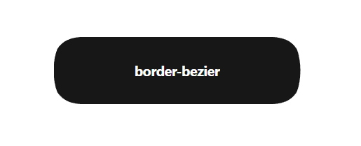

# border-bezier

A tiny, dependency-free CSS + JavaScript library for smooth, continuous
Bézier corners beyond standard `border-radius`.

It is declarative, responsive, customizable through CSS custom properties,
and also exposes a JavaScript API for programmatic control.



## Files

```text
border-bezier/
├── border-bezier.css
├── border-bezier.js
├── border-bezier.module.js
├── demo/
│   └── index.html
├── LICENSE
├── package.json
└── README.md
```

- `border-bezier.css` registers the custom properties and utility selectors.
- `border-bezier.js` is the classic browser build and works through `file://`.
- `border-bezier.module.js` provides ES module exports for bundlers and servers.
- `demo/index.html` is a minimal demo that can be opened directly.

## Quick start

```html
<link rel="stylesheet" href="./border-bezier.css" />
<script defer src="./border-bezier.js"></script>

<div class="pill" data-border-bezier>
  My pill
</div>
```

```css
.pill {
  --border-bezier: 50%;
  --border-bezier-smoothing: 1;

  width: 320px;
  min-height: 88px;
  background: #171717;
  color: white;
}
```

The `.border-bezier` class can be used instead of the
`data-border-bezier` attribute.

## CSS API

| Property | Default | Description |
| --- | ---: | --- |
| `--border-bezier` | `24px` | Corner radius. Supports `px`, `%`, `rem`, `em`, `vw`, `vh`, `vmin`, and `vmax`. |
| `--border-bezier-smoothing` | `1` | Continuous transition strength, clamped between `0` and `1`. |

Use `--border-bezier: 50%` for pills. Percentage values use the element's
smallest dimension as their basis.

## Classic browser API

The classic build automatically mounts every `.border-bezier` and
`[data-border-bezier]` element. Its API is available through
`window.BorderBezier`:

```js
const element = document.querySelector(".card");

const border = BorderBezier.mountBorderBezier(element, {
  radius: 32,
  smoothing: 0.9
});

border.update({ radius: 40 });
border.refresh();
border.destroy();
```

## ES module API

```js
import {
  BorderBezier,
  mountBorderBezier,
  mountAllBorderBezier,
  refreshAllBorderBezier,
  buildBorderBezierPath
} from "./border-bezier.module.js";
```

When `radius` or `smoothing` is not supplied through JavaScript, the value is
read from the corresponding CSS custom property.

After changing a custom property directly through an inline `style`, call
`instance.refresh()` or `refreshAllBorderBezier()`. Element size and class
changes are tracked automatically.

## Direct file usage

The demo uses the classic build, so it can be opened directly without a local
server:

```text
file:///path/to/border-bezier/demo/index.html
```

ES modules still require HTTP or HTTPS in browsers. Use
`border-bezier.module.js` with a local server, bundler, npm package, or deployed
website.

## Browser support

Designed for modern browsers with support for `ResizeObserver` and
`clip-path: path()`.

## Credits

Created by LihnNH, with development assistance from ChatGPT by OpenAI.

## License

MIT